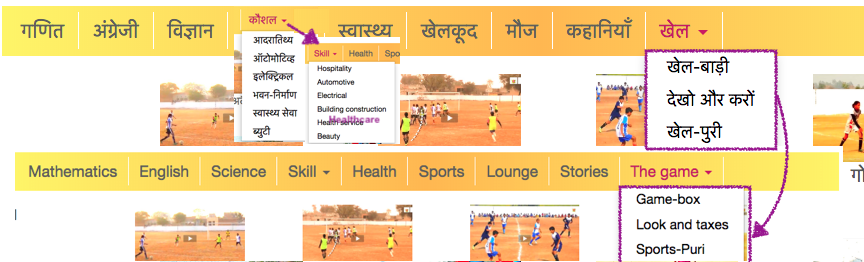

PraDigi Sushi Chef
==================
Import content from prathamopenschool.org and the Pratham gamerepo into Studio.

Design
------
This chef combines data from both the prathamopenschool.org website:
  - Hindi
    - mix of website resource and games (games taken from website preferentially)
    - some extra vocational material taken from youtube playlists
  - Marathi
    - mix of website resource and games (games taken from website preferentially)
  - Other languages
    - Not all folders present, and a few videos of here and there
    - Reuse English from Hindi
  - English
    - Special structure because we must put English stuff in the `Language` topic

The following google spreadhseet are used to determine placement of content nodes within the channel:
  - English https://docs.google.com/spreadsheets/d/1kPOnTVZ5vwq038x1aQNlA2AFtliLIcc2Xk5Kxr852mg/edit#gid=1812185465
  - All other languages https://docs.google.com/spreadsheets/d/1kPOnTVZ5vwq038x1aQNlA2AFtliLIcc2Xk5Kxr852mg/edit#gid=342105160

The following corrections are applied to content before uploading to Kolibri:
https://docs.google.com/spreadsheets/d/1kPOnTVZ5vwq038x1aQNlA2AFtliLIcc2Xk5Kxr852mg/edit#gid=93933238


Install
-------

    # 1. codes
    cd /data
    git clone https://github.com/learningequality/sushi-chef-pradigi.git
    cd sushi-chef-pradigi/
    
    # 2. pythons
    virtualenv -p python3 venv
    source venv/bin/activate
    pip install -r requirements.txt


Running
-------

    ssh chef@vader
        cd sushi-chef-pradigi
        export PHANTOMJS_PATH=/data/sushi-chef-pradigi/phantomjs-2.1.1-linux-x86_64/bin/phantomjs
        source venv/bin/activate
        nohup ./chef.py -v --reset --thumbnails --token=<your_token> &

Use the `--update` option to force re-downloading all files and clear the local
cache directory of zip files (`chefdata/zipfiles`).


Future Updates
--------------
  - Revisit when games with Android API fixed
  - Revisit when missing English games added
  - Optional: load string translations for all languages from shared spreadsheet (not needed right now)


Content Structure Logic
-----------------------
Excel document provides the template for the `Age Group > Subject` structure that
is repeated within each language. The columns in the sheet are:
  - Game Name instead of Name on gamerepo (before lang underscore)
  - Get full game namelist
  - Extract known games from webpage
  - Take from (if a resource needs to be taken from the wrt of another language)
  - 

The content of each subject folder is taken from the top-level website menu,
the yelllo horizontal bar with links:


Special treatment is required for dropdown menus--we ignore the dropdown parent
and instead treat the submenu items as top-level subjects.

The resources under Games are handled differently depending on the age group:
  - `Game-box==CRS122` and `WatchAndDo==CRS124` (Look and Taxes???) only in the `3-6 years` subfolder
  - `Sports-Puri==CRS123` are included only in the `6-10 years` subfolder

For age groups where one or more of the Games subfolders `WatchAndDo`, Game-box, Sports-Puri 
is not included, the games are "extracted" from these folders are extracted and
included in the `Fun`, `Mathematics`, `Language`, and `English` subjects as needed,
according to the structure gsheet.


Backlog
-------

Check what's wrong with these:

```

>>>>> skipping game_resource {'main_file': 'http://www.prathamopenschool.org/CourseContent/Games/BhalooKiBarakhadi_KKS_Hi/index.html', 'kind': 'PrathamZipResource', 'title': 'भालू की बारहखड़ी', 'thumbnail_url': 'http://www.prathamopenschool.org/CourseContent/coverImages/RES5609.png', 'children': [], 'source_id': 'hn/game/5609', 'description': 'source_url=http://www.prathamopenschool.org/CourseContent/Games/BhalooKiBarakhadi_KKS_Hi.zip', 'title_en': 'BhalooKiBarakhadi_KKS_Hi', 'url': 'http://www.prathamopenschool.org/CourseContent/Games/BhalooKiBarakhadi_KKS_Hi.zip'}

>>>>> skipping game_resource {'main_file': 'http://www.prathamopenschool.org/CourseContent/Games/BhalooKiBarakhadi_KKS_MR/index.html', 'kind': 'PrathamZipResource', 'title': 'भभलू ची बाराखडी', 'thumbnail_url': 'http://www.prathamopenschool.org/CourseContent/coverImages/BhalooKiBarakhadi_KKS_MR.png', 'children': [], 'source_id': 'mr/game/7431', 'description': 'source_url=http://www.prathamopenschool.org/CourseContent/Games/BhalooKiBarakhadi_KKS_MR.zip', 'title_en': 'BhalooKiBarakhadi_KKS_MR', 'url': 'http://www.prathamopenschool.org/CourseContent/Games/BhalooKiBarakhadi_KKS_MR.zip'}

>>>>> skipping game_resource {'main_file': 'http://www.prathamopenschool.org/CourseContent/Games/JigsawGame_M/CoverPage.html', 'kind': 'PrathamZipResource', 'title': 'या चित्रात दडलंय काय?', 'thumbnail_url': 'http://www.prathamopenschool.org/CourseContent/coverImages/RES1113.png', 'children': [], 'source_id': 'mr/FunResource/1113', 'description': 'source_url=http://www.prathamopenschool.org/CourseContent/Games/JigsawGame_M.zip', 'title_en': 'JigsawGame_M', 'url': 'http://www.prathamopenschool.org/CourseContent/Games/JigsawGame_M.zip'}

>>>>> skipping game_resource {'main_file': 'http://www.prathamopenschool.org/CourseContent/Games/JigsawGame_M/CoverPage.html', 'kind': 'PrathamZipResource', 'title': 'या चित्रात दडलंय काय?', 'thumbnail_url': 'http://www.prathamopenschool.org/CourseContent/coverImages/RES1113.png', 'children': [], 'source_id': 'mr/FunResource/1113', 'description': 'source_url=http://www.prathamopenschool.org/CourseContent/Games/JigsawGame_M.zip', 'title_en': 'JigsawGame_M', 'url': 'http://www.prathamopenschool.org/CourseContent/Games/JigsawGame_M.zip'}In main loop lang=mr age_group=8-14 years subject_en=Mathematics

>>>>> skipping game_resource {'main_file': 'http://www.prathamopenschool.org/CourseContent/Games/UlatPalat_HI/index.html', 'kind': 'PrathamZipResource', 'title': 'उलट पलट', 'thumbnail_url': 'http://www.prathamopenschool.org/CourseContent/coverImages/UlatpalatCover.png', 'children': [], 'source_id': 'hn/game/3524', 'description': 'source_url=http://www.prathamopenschool.org/CourseContent/Games/UlatPalat_HI.zip', 'title_en': 'UlatPalat_HI', 'url': 'http://www.prathamopenschool.org/CourseContent/Games/UlatPalat_HI.zip'}

>>>>> skipping game_resource {'main_file': 'http://www.prathamopenschool.org/CourseContent/Games/UlatPalat_MR/index.html', 'kind': 'PrathamZipResource', 'title': 'उलट पलट', 'thumbnail_url': 'http://www.prathamopenschool.org/CourseContent/coverImages/RES4080.png', 'children': [], 'source_id': 'mr/game/4080', 'description': 'source_url=http://www.prathamopenschool.org/CourseContent/Games/UlatPalat_MR.zip', 'title_en': 'UlatPalat_MR', 'url': 'http://www.prathamopenschool.org/CourseContent/Games/UlatPalat_MR.zip'}
skipping <a class="dropdown-toggle" data-toggle="dropdown" href="#" style="background: transparent;">

```


- Cross check games on website http://www.prathamopenschool.org/CourseContent/Games/
  vs combined list of games from gamerepo
